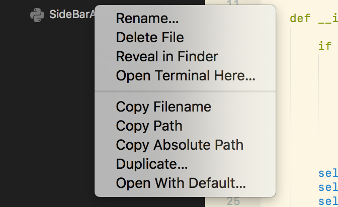

# Sidebar Tools

   

Some useful tools to add to your sidebar context menu and command palette:

* Reveal In Sidebar
* Copy Filename
* Copy Relative Path
* Copy Absolute Path
* Duplicate

If you're missing the "Open With Default" command, consider installing the
[Open in Default Application][5] package.

This package offers a subset of commands from the original
[SidebarEnhancements][1], striking a balance somewhere between the bare minimum
and the kitchen sink.

* The default context menu isn't replaced, this package just adds some useful new commands.
* It's tiny, fast and reliable.
* We won't [track][2] you. Ever.

## INSTALLATION

### Package Control installation

The preferred method of installation is [Package Control](https://packagecontrol.io/browse/authors/braver).

### Manual installation

1. Close Sublime Text.
2. Download or clone this repository to a directory named **`SideBarTools`** in the Sublime Text Packages directory for your platform:
    * Linux: `git clone https://github.com/braver/SideBarTools.git ~/.config/sublime-text-3/Packages/SideBarTools`
    * OS X: `git clone https://github.com/braver/SideBarTools.git ~/Library/Application\ Support/Sublime\ Text\ 3/Packages/SideBarTools`
    * Windows: `git clone https://github.com/braver/SideBarTools.git %APPDATA%\Sublime/ Text/ 3/Packages/SideBarTools`
3. Done!

## LICENSE

SidebarEnhancements © 2014 [Tito Bouzout][3]
License: [GNU GPL][4]

[1]: https://packagecontrol.io/packages/SideBarEnhancements
[2]: https://github.com/SideBarEnhancements-org/SideBarEnhancements/blob/d1c7fa4bac6a1f31ba177bc41ddd0ca902e43609/Stats.py
[3]: mailto:tito.bouzout@gmail.com
[4]: http://www.gnu.org/licenses/gpl.html
[5]: https://packagecontrol.io/packages/Open%20in%20Default%20Application
